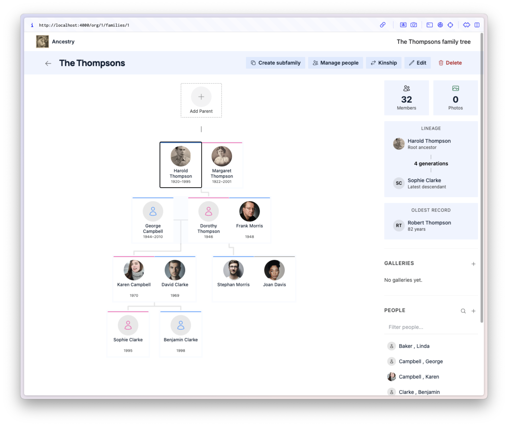

# Ancestry

A family tree and photo gallery application. Map out your family relationships and preserve memories through organized photo galleries with real-time updates and background image processing.



## Reporting Issues

Please report bugs and feature requests by opening an issue on this repository's [GitHub Issues](https://github.com/san650/ancestry/issues) page.

## Development

### Software Dependencies

- [Elixir](https://elixir-lang.org/) ~> 1.15
- [PostgreSQL](https://www.postgresql.org/)
- [ImageMagick](https://imagemagick.org/) (used for photo processing)
- [Node.js](https://nodejs.org/) (for asset building)

### Getting Started

Install dependencies and set up the database:

```sh
mix setup
```

Start the development server:

```sh
iex -S mix phx.server
```

The app will be available at [http://localhost:4000](http://localhost:4000).

### Running Tests

```sh
mix test
```

### Pre-commit Checks

```sh
mix precommit
```

## Contributing

1. Fork the repository
2. Create your feature branch (`git checkout -b my-feature`)
3. Make sure `mix precommit` passes
4. Commit your changes
5. Push to the branch and open a Pull Request

## Copyright

Copyright (c) Santiago Ferreira. See [LICENSE](./LICENSE) for details.
