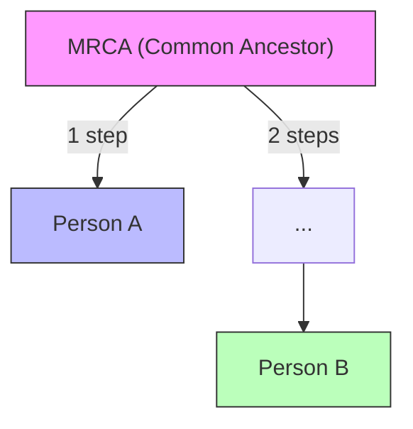
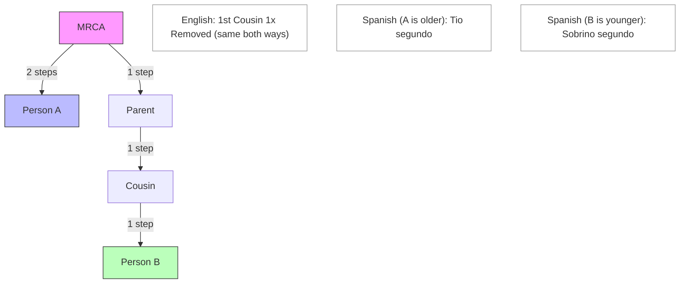
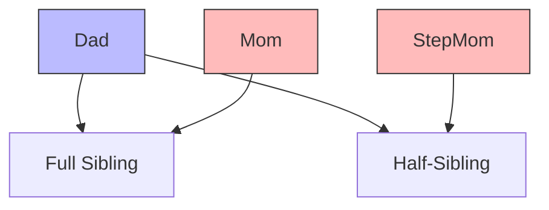
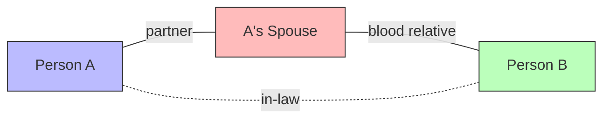
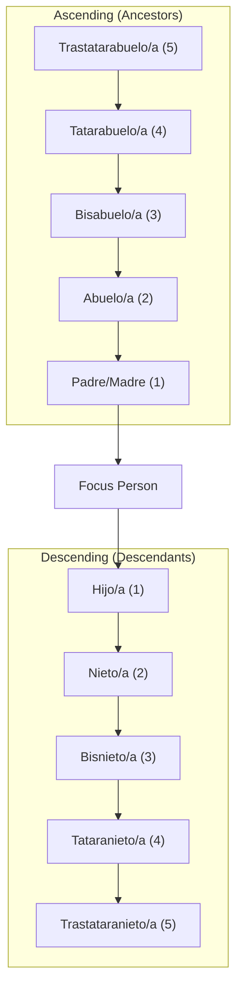
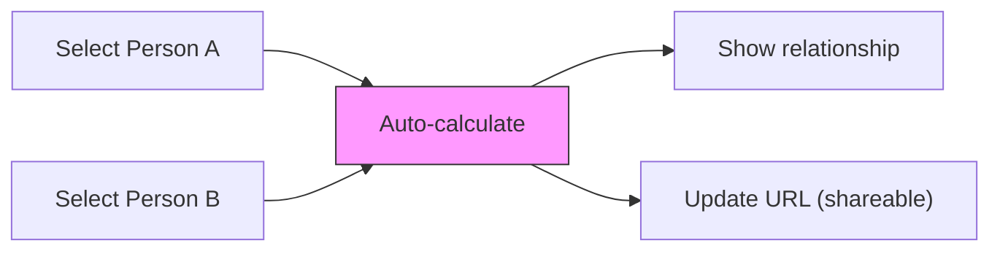

# Kinship: How Relationship Labels Work

This document explains how the app names the relationship between any two people in a family — the rules, the differences between English and Spanish, and the decisions we made along the way.

---

## The Basic Idea

Given any two people in a family, the app finds their **Most Recent Common Ancestor (MRCA)** — the closest person (or couple) they both descend from — and counts how many generations separate each person from that ancestor. Those two numbers determine the relationship label.

In this example, A is 1 generation from the MRCA and B is 2 generations away — making A person B's uncle/aunt.

---

## How English and Spanish Differ

This is where things get interesting — and where most of our design decisions come from.

### English Is Simple (and Lossy)

English kinship terms are **direction-agnostic** for cousins. "First cousin once removed" means the same thing whether you're the older or younger person. You can't tell from the label alone who is in the higher generation.

English also uses a **single gendered pair** for most relationships (uncle/aunt, nephew/niece) and doesn't gender cousins at all ("my cousin" — no male/female distinction).

### Spanish Is Precise (and Complex)

Spanish kinship is **direction-aware** and **fully gendered**. The same two people who are both "first cousin once removed" in English have *different* labels in Spanish depending on who is older:

- The older person (closer to the MRCA) is called **Tio segundo / Tia segunda** — a "second uncle/aunt"
- The younger person is called **Sobrino segundo / Sobrina segunda** — a "second nephew/niece"

Spanish also genders cousins (**primo/prima**), and every adjective in compound terms agrees in gender: "Tio abuelo" (male great-uncle) vs. "Tia abuela" (female great-aunt).

### The "Removed Cousin" Conversion

This is the single biggest difference and our most important design decision:

**English** uses "Nth Cousin, M Times Removed" for cross-generational cousins. This is one system that works in all directions.

**Spanish** doesn't have "removed cousins" at all. Instead, it converts them into the uncle/nephew family of terms:

| English | Spanish (male, older) | Spanish (male, younger) |
|---------|----------------------|------------------------|
| 1st Cousin 1x Removed | Tio segundo | Sobrino segundo |
| 1st Cousin 2x Removed | Tio abuelo segundo | Sobrino nieto segundo |
| 2nd Cousin 1x Removed | Tio tercero | Sobrino tercero |

The pattern: "removed" cousins become extended uncle/nephew terms where the generation gap adds ancestor/descendant qualifiers (abuelo, bisabuelo, etc.) and the collateral distance adds ordinal suffixes (segundo, tercero, etc.).

---

## Decisions We Made

### 1. Labels Describe "What A Is to B"

The label always answers the question: "What is person A to person B?" The label is gendered by **person A's** gender, not B's.

This matters because Spanish in-law terms like Yerno (son-in-law) and Nuera (daughter-in-law) aren't gendered forms of the same word — they're entirely different words. The label must know A's gender to pick the right one.

### 2. Three Gender Forms for Every Label

Every relationship has three label variants: **male**, **female**, and **unknown**. The unknown form uses slash notation: "Tio/a abuelo/a segundo/a". This handles people whose gender hasn't been recorded.

### 3. Half-Relationships

When two people share only **one** parent at the MRCA level (instead of a couple), the relationship is "half." Half-sibling, half-cousin, half-uncle, etc.

Full siblings share **both** parents at the MRCA. Half-siblings share only **one**. The label gets prefixed: "Half-brother" in English, "Medio hermano" in Spanish.

In Spanish, "half" becomes **Medio/Media** prefixed to the label: "Medio hermano" (half-brother), "Media prima segunda" (female half second cousin).

### 4. DNA Percentage (Approximate)

The app shows an approximate shared DNA percentage for blood relatives. The formula is based on generational distance:

- Direct line (parent, grandparent): 100% / 2^generations
- Collateral (siblings, cousins): 100% / 2^(steps_a + steps_b - 1)
- Half-relationships: halved again

This is displayed with a "~" prefix and a disclaimer that it's a statistical approximation. In-law relationships don't show DNA percentages.

### 5. In-Laws: One Partner Hop

In-law detection kicks in when blood kinship finds no common ancestor. The system checks whether person A's partner (or person B's partner) creates a blood connection.

Key rules:
- **Only one partner hop.** We don't chain through multiple marriages (no "co-parent-in-law" / consuegro).
- **Three special Spanish terms** replace the generic pattern: Suegro/a (parent-in-law), Yerno/Nuera (child-in-law), Cuñado/a (sibling-in-law). Everything else uses the blood label + "politico/a" suffix.
- **Blood takes priority.** If a blood connection exists, the in-law path is never shown — even if the people are also connected by marriage.

### 6. Blood Before In-Law, Always

The kinship calculator tries blood kinship first. Only if no common ancestor is found does it attempt in-law detection. This means a person who is both your blood cousin and your spouse's sibling will always show the blood relationship.

### 7. "Times Removed" Footnote

When the English label contains "Removed," the UI shows a brief footnote explaining the concept: a removed cousin is a relative from a different generation, and the number tells you how many generations apart. This was added because most people don't intuitively understand "removed" in the genealogical sense.

---

## The Spanish Naming System

Spanish kinship builds labels from three components:

### Direct Line

For 6+ generations, numeric ordinals take over: "5° Abuelo" (ancestor), "5° Nieto" (descendant).

Every term has masculine/feminine forms (Abuelo/Abuela, Nieto/Nieta, etc.).

### Same Generation (Cousins)

- Generation 1: Hermano/Hermana (sibling)
- Generation 2+: Primo/Prima + ordinal suffix for degree 2+

Ordinal suffixes agree in gender: "Primo segundo" (male), "Prima segunda" (female).

### Cross-Generation (Uncle/Nephew Direction)

Labels are built from three pieces:

1. **Base:** Tio/Tia (ascending, older) or Sobrino/Sobrina (descending, younger)
2. **Generation suffix:** How far apart beyond one generation — uses the ancestor/descendant names (abuelo, bisabuelo, nieto, bisnieto, etc.)
3. **Ordinal suffix:** The collateral distance — segundo, tercero, cuarto, etc.

Example: A male person who is 4 generations from the MRCA, and the other person is 7 generations away:
- Direction: ascending (4 < 7)
- Base: "Tio"
- Generation gap: 3 (removed = |4-7|) → "bisabuelo"
- Collateral distance: 4 → "cuarto"
- Result: **"Tio bisabuelo cuarto"**

---

## The Kinship Calculator Page

The kinship calculator is a page where users select two people and see their relationship.

### How It Works

1. Two person selectors side by side, with a swap button between them
2. Searchable dropdowns with photos and names
3. Calculation is automatic when both people are selected (no button needed)
4. The URL updates with both person IDs so the result is shareable

### What It Shows

- **Relationship label** — prominent, in the user's language
- **Directional sentence** — "Person B is Person A's [relationship]"
- **DNA percentage** — for blood relatives, with "approximate" disclaimer
- **Visual path** — shows the route through the MRCA as a branching diagram (inverted V on desktop, vertical list on mobile)
- **"Related by marriage" note** — for in-law relationships
- **"Times removed" footnote** — when the English label contains "removed"

### Edge Cases in the UI

- Same person selected: error message
- No relationship found: clear "no relationship" message
- Unknown gender: labels use slash notation (Tio/a, Primo/a)
- Very distant relationships: labels use numeric ordinals (5° Abuelo, 6° Nieto)

---

## Reference

The complete coordinate-to-label mapping tables (with every combination of steps_a, steps_b, and gender for both languages) are in [GENEALOGY.md](../GENEALOGY.md). That file is the single source of truth for label correctness.
