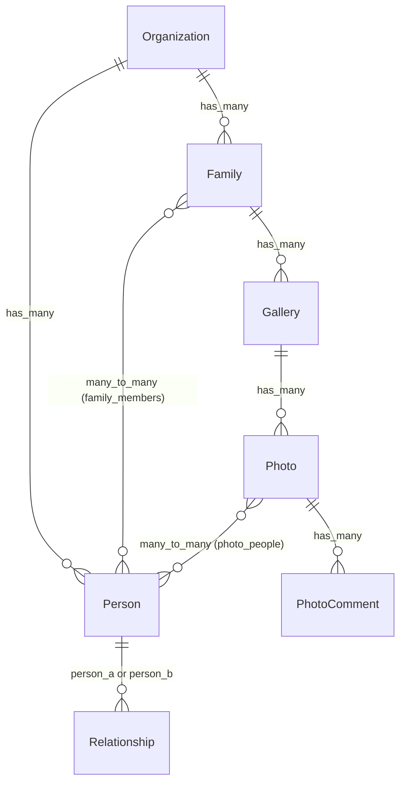

# Add Organization as Base Tenant

## Overview

Introduce an Organization entity as the top-level tenant for the application. All families, people, galleries, photos, relationships, and comments become scoped to an organization. The landing page (`/`) lists organizations, and all routes move under `/org/:org_id/`.

## Problem Statement / Motivation

The app currently treats Family as the implicit top-level entity with no multi-tenant isolation. Adding Organization above Family enables data isolation — people, families, and all related data in one organization are invisible to another.

## Proposed Solution

Add `organization_id` to `families` and `persons` tables only (see brainstorm: `docs/brainstorms/2026-03-21-organization-tenant-brainstorm.md`). Other entities inherit org scope through their parent chain (Gallery→Family, Photo→Gallery→Family, Relationship→Person, etc.). Person belongs to exactly one org via direct FK (NOT NULL). All context functions that list, search, or create entities are scoped by organization_id.

## Technical Approach

### Architecture



**New route structure:**
```
/                                              → OrganizationLive.Index
/org/:org_id                                   → FamilyLive.Index
/org/:org_id/families/new                      → FamilyLive.New
/org/:org_id/families/:family_id               → FamilyLive.Show
/org/:org_id/families/:family_id/galleries/:id → GalleryLive.Show
/org/:org_id/families/:family_id/members/new   → PersonLive.New
/org/:org_id/families/:family_id/kinship       → KinshipLive
/org/:org_id/families/:family_id/people        → PeopleLive.Index
/org/:org_id/people/:id                        → PersonLive.Show
```

### Implementation Phases

#### Phase 1: Foundation — Schema, Migration, Context, Seeds

**Goal:** Organization exists in the database, families and persons have the FK, seeds work.

##### 1.1 Create Organization schema

**New file: `lib/ancestry/organizations/organization.ex`**

```elixir
defmodule Ancestry.Organizations.Organization do
  use Ecto.Schema
  import Ecto.Changeset

  schema "organizations" do
    field :name, :string

    has_many :families, Ancestry.Families.Family
    has_many :people, Ancestry.People.Person

    timestamps()
  end

  def changeset(organization, attrs) do
    organization
    |> cast(attrs, [:name])
    |> validate_required([:name])
    |> validate_length(:name, min: 1, max: 255)
  end
end
```

##### 1.2 Create Organizations context

**New file: `lib/ancestry/organizations.ex`**

```elixir
defmodule Ancestry.Organizations do
  import Ecto.Query
  alias Ancestry.Repo
  alias Ancestry.Organizations.Organization

  def list_organizations do
    Repo.all(from o in Organization, order_by: [asc: o.name])
  end

  def get_organization!(id), do: Repo.get!(Organization, id)

  def create_organization(attrs \\ %{}) do
    %Organization{}
    |> Organization.changeset(attrs)
    |> Repo.insert()
  end

  def update_organization(%Organization{} = org, attrs) do
    org
    |> Organization.changeset(attrs)
    |> Repo.update()
  end

  def delete_organization(%Organization{} = org) do
    Repo.delete(org)
  end

  def change_organization(%Organization{} = org, attrs \\ %{}) do
    Organization.changeset(org, attrs)
  end
end
```

##### 1.3 Migration: create organizations table

**New file: `priv/repo/migrations/TIMESTAMP_create_organizations.exs`**
Generate with: `mix ecto.gen.migration create_organizations`

```elixir
defmodule Ancestry.Repo.Migrations.CreateOrganizations do
  use Ecto.Migration

  def change do
    create table(:organizations) do
      add :name, :text, null: false
      timestamps()
    end
  end
end
```

##### 1.4 Migration: add organization_id to families and persons

**New file: `priv/repo/migrations/TIMESTAMP_add_organization_id_to_families_and_persons.exs`**
Generate with: `mix ecto.gen.migration add_organization_id_to_families_and_persons`

```elixir
defmodule Ancestry.Repo.Migrations.AddOrganizationIdToFamiliesAndPersons do
  use Ecto.Migration

  def up do
    # Create a default organization for existing data
    execute """
    INSERT INTO organizations (name, inserted_at, updated_at)
    VALUES ('Default Organization', NOW(), NOW())
    """

    # Add organization_id to families (nullable first for backfill)
    alter table(:families) do
      add :organization_id, references(:organizations, on_delete: :delete_all)
    end

    # Backfill families
    execute """
    UPDATE families SET organization_id = (SELECT id FROM organizations LIMIT 1)
    """

    # Make NOT NULL
    alter table(:families) do
      modify :organization_id, :bigint, null: false
    end

    create index(:families, [:organization_id])

    # Add organization_id to persons (nullable first for backfill)
    alter table(:persons) do
      add :organization_id, references(:organizations, on_delete: :delete_all)
    end

    # Backfill persons
    execute """
    UPDATE persons SET organization_id = (SELECT id FROM organizations LIMIT 1)
    """

    # Make NOT NULL
    alter table(:persons) do
      modify :organization_id, :bigint, null: false
    end

    create index(:persons, [:organization_id])
  end

  def down do
    alter table(:persons) do
      remove :organization_id
    end

    alter table(:families) do
      remove :organization_id
    end

    execute "DELETE FROM organizations"
  end
end
```

##### 1.5 Update Family schema

**Modified file: `lib/ancestry/families/family.ex`**

Add `belongs_to :organization, Ancestry.Organizations.Organization` to the schema. Do NOT add `:organization_id` to `cast` (it is set programmatically, per CLAUDE.md convention).

##### 1.6 Update Person schema

**Modified file: `lib/ancestry/people/person.ex`**

Add `belongs_to :organization, Ancestry.Organizations.Organization` to the schema. Do NOT add `:organization_id` to `cast`.

##### 1.7 Update seeds

**Modified file: `priv/repo/seeds.exs`**

Create a default organization first, then pass it to family/person creation:

```elixir
{:ok, org} = Ancestry.Organizations.create_organization(%{name: "Default Organization"})

{:ok, family} = Ancestry.Families.create_family(%{name: "The Thompsons"}, org)
# ... rest of seeds use org for person creation
```

---

#### Phase 2: Context Scoping

**Goal:** All context functions enforce org isolation.

##### 2.1 Update Families context

**Modified file: `lib/ancestry/families.ex`**

| Function | Change |
|----------|--------|
| `list_families/0` | Rename to `list_families/1`, accept `org_id`, filter by `organization_id` |
| `create_family/1` | Change to `create_family/2` accepting `(%Organization{}, attrs)`, set `organization_id` programmatically via `Ecto.build_assoc` or `Map.put` |
| `get_family!/1` | No signature change, but callers must validate `family.organization_id == org_id` (see Phase 4) |
| `delete_family/1` | No change needed (org scoping is in list/create) |
| `change_family/2` | No change needed |

##### 2.2 Update People context

**Modified file: `lib/ancestry/people.ex`**

| Function | Change |
|----------|--------|
| `list_people_for_family/1` | No change (already family-scoped, family is org-scoped) |
| `list_people_for_family_with_relationship_counts/1..3` | No change |
| `create_person/2` | Change to `create_person/3` accepting `(family, attrs, org)`, set `organization_id` on person |
| `create_person_without_family/1` | Change to `create_person_without_family/2` accepting `(attrs, org)`, set `organization_id` |
| `search_people/2` | Change to `search_people/3` accepting `(query, exclude_family_id, org_id)`, add `where: p.organization_id == ^org_id` |
| `search_all_people/1` | Change to `search_all_people/2` accepting `(query, org_id)`, add org filter |
| `search_all_people/2` (with exclude) | Change to `search_all_people/3` accepting `(query, exclude_person_id, org_id)`, add org filter |
| `search_family_members/3` | No change (already family-scoped) |
| `add_to_family/2` | Add validation: `person.organization_id == family.organization_id` |
| `get_person!/1` | No signature change, callers validate org match |

##### 2.3 Verify inherited scoping

These context modules need **no changes** because they inherit org scope through their parents:

- **Galleries** — scoped through Family (family_id on gallery)
- **Relationships** — scoped through Person (both person_a and person_b must be in the same org since search is org-scoped)
- **Comments** — scoped through Photo→Gallery→Family
- **Kinship** — operates on two persons within a family (already org-scoped)

---

#### Phase 3: Router + OrganizationLive

**Goal:** New landing page, all routes under `/org/:org_id/`.

##### 3.1 Create OrganizationLive.Index

**New file: `lib/web/live/organization_live/index.ex`**

Follows the same pattern as `FamilyLive.Index`:
- `mount/3`: Load all organizations via `Organizations.list_organizations()`
- Template: Grid of org cards with name, link to `/org/:org_id`
- Include "New Organization" button linking to a create flow (modal or separate page)

**New file: `lib/web/live/organization_live/index.html.heex`**

Grid layout similar to `FamilyLive.Index` — card per organization with name. Empty state when no orgs exist.

##### 3.2 Update router

**Modified file: `lib/web/router.ex`**

```elixir
scope "/", Web do
  pipe_through :browser

  live_session :default do
    live "/", OrganizationLive.Index, :index

    scope "/org/:org_id" do
      live "/", FamilyLive.Index, :index
      live "/families/new", FamilyLive.New, :new
      live "/families/:family_id", FamilyLive.Show, :show
      live "/families/:family_id/galleries/:id", GalleryLive.Show, :show
      live "/families/:family_id/members/new", PersonLive.New, :new
      live "/families/:family_id/kinship", KinshipLive, :index
      live "/families/:family_id/people", PeopleLive.Index, :index
      live "/people/:id", PersonLive.Show, :show
    end
  end
end
```

Note: The inner `scope "/org/:org_id"` does NOT have a module alias — it only provides the path prefix and param extraction.

---

#### Phase 4: LiveView + Component Updates

**Goal:** All LiveViews extract `org_id`, validate org ownership, propagate to components.

##### 4.1 Update all family-scoped LiveViews

Every LiveView that currently extracts `family_id` in `mount/3` must also extract `org_id` and validate ownership.

**Pattern for all mounts:**

```elixir
def mount(%{"org_id" => org_id, "family_id" => family_id}, _session, socket) do
  org = Organizations.get_organization!(org_id)
  family = Families.get_family!(family_id)

  # Validate org ownership
  if family.organization_id != org.id, do: raise Ecto.NoResultsError, queryable: Family

  {:ok, assign(socket, org: org, family: family, ...)}
end
```

**Files to update:**

| File | Change |
|------|--------|
| `lib/web/live/family_live/index.ex` | Extract `org_id`, load org, pass to `list_families(org.id)` |
| `lib/web/live/family_live/new.ex` | Extract `org_id`, pass org to `create_family` |
| `lib/web/live/family_live/show.ex` | Extract `org_id`, validate family.organization_id matches |
| `lib/web/live/gallery_live/show.ex` | Extract `org_id`, validate family.organization_id matches |
| `lib/web/live/gallery_live/index.ex` | Extract `org_id`, validate |
| `lib/web/live/person_live/new.ex` | Extract `org_id`, pass org to `create_person` |
| `lib/web/live/person_live/show.ex` | Extract `org_id`, validate person.organization_id matches |
| `lib/web/live/people_live/index.ex` | Extract `org_id`, validate |
| `lib/web/live/kinship_live.ex` | Extract `org_id`, validate |

##### 4.2 Update all ~p route paths

Every `~p"/..."` path in templates and LiveViews must include the `/org/#{org_id}` prefix.

**Search-and-replace patterns:**

| Old pattern | New pattern |
|-------------|-------------|
| `~p"/"` (when linking to families) | `~p"/org/#{@org.id}"` |
| `~p"/families/new"` | `~p"/org/#{@org.id}/families/new"` |
| `~p"/families/#{...}"` | `~p"/org/#{@org.id}/families/#{...}"` |
| `~p"/families/#{...}/galleries/#{...}"` | `~p"/org/#{@org.id}/families/#{...}/galleries/#{...}"` |
| `~p"/families/#{...}/members/new"` | `~p"/org/#{@org.id}/families/#{...}/members/new"` |
| `~p"/families/#{...}/kinship"` | `~p"/org/#{@org.id}/families/#{...}/kinship"` |
| `~p"/families/#{...}/people"` | `~p"/org/#{@org.id}/families/#{...}/people"` |
| `~p"/people/#{...}"` | `~p"/org/#{@org.id}/people/#{...}"` |

**Files with route paths (comprehensive list):**

- `lib/web/live/family_live/show.ex`
- `lib/web/live/family_live/show.html.heex`
- `lib/web/live/family_live/new.ex`
- `lib/web/live/family_live/new.html.heex`
- `lib/web/live/family_live/index.html.heex`
- `lib/web/live/person_live/show.ex`
- `lib/web/live/person_live/show.html.heex`
- `lib/web/live/person_live/new.ex`
- `lib/web/live/person_live/new.html.heex`
- `lib/web/live/gallery_live/show.html.heex`
- `lib/web/live/gallery_live/index.html.heex`
- `lib/web/live/kinship_live.html.heex`
- `lib/web/live/people_live/index.html.heex`
- `lib/web/live/family_live/gallery_list_component.ex`
- `lib/web/live/family_live/people_list_component.ex`
- `lib/web/live/family_live/person_card_component.ex`
- `lib/web/components/layouts.ex` (navbar)
- `lib/web/components/layouts/app.html.heex` (if route paths exist here)

##### 4.3 Update components to receive org

All components that generate URLs need `org` (or `org_id`) as an assign:

| Component | How it receives org |
|-----------|-------------------|
| `PeopleListComponent` | `org={@org}` from FamilyLive.Show |
| `GalleryListComponent` | `org={@org}` from FamilyLive.Show |
| `PersonCardComponent` | `org={@org}` from FamilyLive.Show |
| `SidePanelComponent` | `org={@org}` from FamilyLive.Show (passes down) |
| `PersonSelectorComponent` | `org={@org}` from FamilyLive.Show (for scoped search) |
| `AddRelationshipComponent` | `org={@org}` from PersonLive.Show / FamilyLive.Show |
| `PersonFormComponent` | `org={@org}` if it generates any links |
| `PhotoInteractions` (shared module) | Receives org_id for `search_all_people` calls |

##### 4.4 Update layout / navbar

**Modified file: `lib/web/components/layouts.ex`**

- Accept optional `org` assign
- When `org` is set: show org name as breadcrumb, "Families" links to `/org/:org_id`
- Logo/home link always goes to `/` (org list)
- "Families" text becomes dynamic based on context

All LiveViews inside an org scope pass `org={@org}` to `<Layouts.app>`.

##### 4.5 PersonLive.Show back-navigation

PersonLive.Show currently uses `?from_family=:id` for back-navigation. Since the route is now `/org/:org_id/people/:id`, org_id comes from the URL params. The `from_family` param continues to work unchanged — the back link just uses `@org` from socket assigns:

```elixir
# Back to family
~p"/org/#{@org.id}/families/#{@from_family.id}"

# Back to org families list (when no from_family)
~p"/org/#{@org.id}"
```

---

#### Phase 5: Tests + Factory

**Goal:** All tests pass with org-scoped routes and data.

##### 5.1 Update factory

**Modified file: `test/support/factory.ex`**

```elixir
def organization_factory do
  %Ancestry.Organizations.Organization{
    name: sequence(:org_name, &"Organization #{&1}")
  }
end
```

Update `family_factory` to include `organization: build(:organization)`.
Update `person_factory` to include `organization: build(:organization)`.

##### 5.2 Update existing user flow tests

All 11 test files in `test/user_flows/` need route updates. Each test must:
1. Create an organization via factory
2. Associate families/persons with that org
3. Use `/org/#{org.id}/...` in all route visits

##### 5.3 Add new test coverage

**New test: `test/user_flows/organization_listing_test.exs`**

```
Given a system with organizations
When the user visits /
Then the organizations are listed

When the user clicks on an organization
Then the families for that organization are shown
```

**New test: `test/user_flows/organization_data_isolation_test.exs`**

```
Given two organizations with different families and people
When the user navigates to org A
Then only org A's families are visible

When the user navigates to org A and tries to access org B's family by ID
Then a 404 / not found error is shown

When the user searches for people within org A
Then only org A's people appear in results
```

---

## System-Wide Impact

### Interaction Graph

Route change → every `~p` sigil must update → every component receiving URLs must get `org` assign → every test visiting routes must update. Context function signature changes → every LiveView calling those functions must update args.

### Error Propagation

`Organizations.get_organization!/1` raises `Ecto.NoResultsError` for invalid org_id → Phoenix returns 404. Org ownership validation in mount raises same error → 404. These flow through the standard Phoenix error handling pipeline.

### State Lifecycle Risks

- **Migration backfill**: If the migration fails mid-way (after creating org table but before backfilling), families/persons have NULL org_id. The two-step nullable→backfill→NOT NULL pattern prevents this.
- **Person-family org mismatch**: Application-level validation in `add_to_family/2` prevents inconsistency. No database constraint, but the search scoping also prevents finding cross-org persons.

### API Surface Parity

No external API exists. All changes are internal LiveView routing and context functions.

### Integration Test Scenarios

1. Create org → create family in org → navigate to family → see family tree (end-to-end)
2. Two orgs with overlapping person names → search from org A returns only org A's people
3. Deep-link to `/org/1/families/5` where family 5 is in org 2 → 404
4. Create person without family from AddRelationshipComponent → person gets correct org_id
5. Delete org → cascades to families → cascades to galleries/photos

## Acceptance Criteria

### Functional Requirements

- [ ] Organization schema exists with `name` field and full CRUD
- [ ] Landing page (`/`) lists all organizations
- [ ] Clicking an org navigates to its families at `/org/:org_id`
- [ ] All existing routes work under `/org/:org_id/` prefix
- [ ] Families list is scoped to the current organization
- [ ] Person search (link person, photo tagging, add relationship) is scoped to current org
- [ ] Creating a family assigns it to the current org
- [ ] Creating a person assigns it to the current org
- [ ] `add_to_family` validates org consistency
- [ ] Navigating to an entity belonging to a different org returns 404
- [ ] Default organization created in seeds with Thompson family
- [ ] Navbar shows org context when inside an org
- [ ] Back-navigation works correctly with org prefix

### Non-Functional Requirements

- [ ] Migration handles existing data (backfill to default org)
- [ ] Migration is reversible (`down` function works)
- [ ] No N+1 queries introduced (org loaded once in mount, not per-item)

### Testing Requirements

- [ ] All existing user flow tests updated and passing
- [ ] New test: organization listing flow
- [ ] New test: cross-org data isolation
- [ ] `mix precommit` passes (compile warnings-as-errors, format, tests)

## Dependencies & Risks

- **Risk**: Missing a `~p` path update → broken link at runtime. **Mitigation**: Grep for all `~p"/families` and `~p"/people` occurrences; compiler will catch invalid verified routes.
- **Risk**: Context function arity changes break callers. **Mitigation**: Compiler will catch all call sites.
- **Risk**: Migration on production with large data sets. **Mitigation**: Backfill uses simple UPDATE with subquery; add index after backfill.

## Sources & References

### Origin

- **Brainstorm document:** [docs/brainstorms/2026-03-21-organization-tenant-brainstorm.md](docs/brainstorms/2026-03-21-organization-tenant-brainstorm.md) — Key decisions: org_id on families+persons only, person belongs to one org, minimal schema, routes under `/org/:org_id/`.

### Internal References

- Family schema pattern: `lib/ancestry/families/family.ex`
- Families context pattern: `lib/ancestry/families.ex`
- Router structure: `lib/web/router.ex`
- Seeds: `priv/repo/seeds.exs`
- Factory: `test/support/factory.ex`
- Member route design (from_family pattern): `docs/plans/2026-03-19-member-routes-design.md`

### Institutional Learnings

- Never use nil params to branch behavior; use separate named functions (feedback memory)
- Use `?from_family=` query params for cross-context back-navigation (docs/plans/2026-03-19-member-routes-design.md)
- Always add indexes on foreign keys in migrations
- FK fields set programmatically, never in `cast` (CLAUDE.md)
