# TreeView: Family Tree Visualization

This document describes **what** the TreeView must do and **why** — the requirements, constraints, and edge cases that make genealogy trees fundamentally different from generic tree visualizations. For kinship terminology and labeling rules, see [docs/KINSHIP.md](../../../docs/KINSHIP.md).

---

## What Is the TreeView?

The TreeView is the visual family tree shown on the Family Show page. It lets a user pick any person in their family and see that person's ancestors above, descendants below, and partners alongside — all laid out so that each generation sits at the same horizontal level.

It is the primary way users explore "who is related to whom" in their family.

---

## Why Is This Hard?

A family is **not** a tree in the traditional sense. It's a graph with loops, forks, and multiple paths between the same people. The TreeView must flatten this messy graph into something that *looks* like a tree while preserving genealogical correctness.

Specific reasons it's harder than a typical org chart or file browser:

1. **Two parents, not one.** Every person has (up to) two biological parents. This means the tree doubles in width with each ancestor generation: 1 couple, 2 couples, 4 couples, 8 couples.

2. **People play multiple roles.** The same person can be someone's uncle AND someone else's grandfather. In the tree, that person appears in every position they occupy — they are "cloned" into each role.

3. **Pedigree collapse.** When cousins marry, their children reach the same ancestor through both parents. The shared ancestor appears twice in the tree (once on each side). This is correct — the tree shows roles, not unique individuals.

4. **Partner relationships are horizontal.** Couples sit side-by-side within a generation, not in a parent-child hierarchy. This creates non-hierarchical edges that a simple tree structure can't represent.

5. **Blended families.** Ex-partners, previous partners, and solo children create asymmetric branching. One person might have children with three different partners, each group needing its own visual treatment.

### A Simple Family

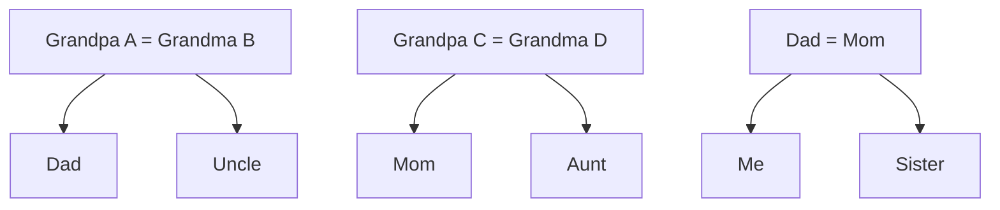

### Pedigree Collapse (Cousins Who Married)

The same grandparents appear on **both** sides of the tree — this is correct:

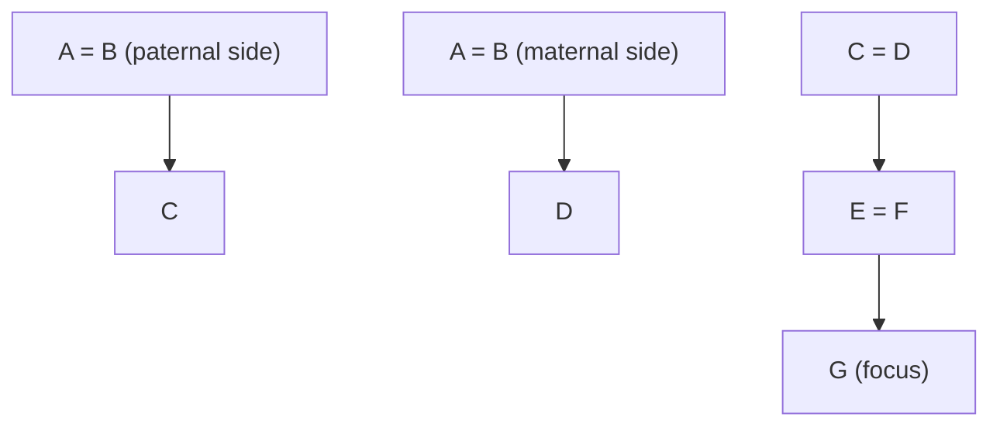

### Blended Family

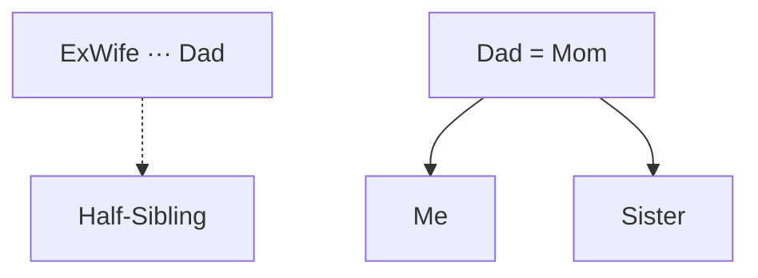

---

## How Cycles Are Broken: From Cyclic Graph to Directed Acyclic Graph

The family data is a cyclic graph — but the view must be a **directed acyclic graph (DAG)** with no cycles. It's not technically a tree either, since it has multiple root nodes (the oldest known ancestors) and multiple leaf nodes (the youngest descendants). This section explains the two rules that eliminate cycles, the duplication strategy that keeps the result genealogically correct, and every type of cycle that can occur in real family data.

### The Two Rules

**Rule 1: Only follow parent edges upward.** When building ancestors, the traversal walks upward through parent edges only. Partner edges are never followed to discover new ancestors — they're only used to display who is partnered with whom at each level.

**Rule 2: Only follow child edges downward.** When building descendants, the traversal walks downward through child edges only. It never follows a partner edge back up.

These two rules guarantee the output is acyclic. When a person is reachable through multiple paths, they are **duplicated** — they appear as an independent card in every position they occupy. All copies link to the same person (clicking any of them navigates to that person), but visually they are separate cards.

This is the correct genealogical behavior. The DAG shows **positions** (roles in the family structure), not unique individuals.

---

### Catalog of Cycle Types

Every cycle in a family graph falls into one of five categories. Each is shown below as the problem (the real family graph, which has cycles) and the resolution (the rendered DAG, which duplicates people to break them).

---

### Type 1: Cousins Who Marry (Classic Pedigree Collapse)

The most common cycle in real genealogy. Two first cousins share the same grandparents and have a child together.

**Why it's a cycle:** The focus person's ancestor walk reaches the same couple (Grandpa + Grandma) through two independent paths — once up through Dad, once up through Mom.

**The family graph (cyclic):**

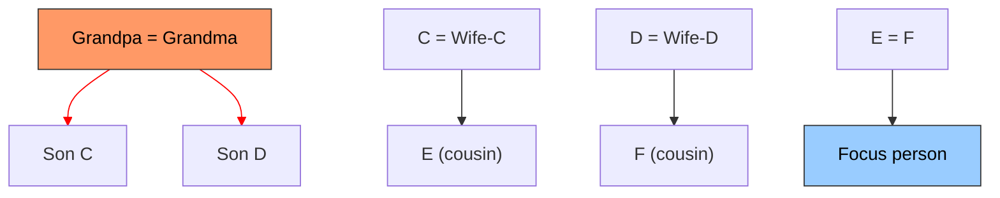

The red edges show the two paths that both reach Grandpa = Grandma. That's the cycle: Focus → E → C → **Grandpa = Grandma** and Focus → F → D → **Grandpa = Grandma**.

**The rendered DAG (cycle broken):**

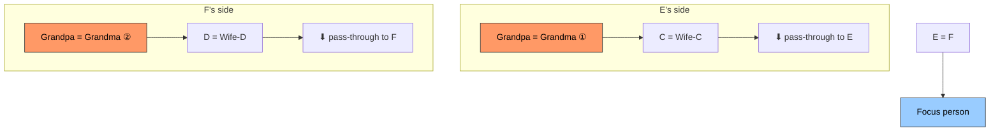

**What gets duplicated:** Grandpa and Grandma each appear twice — once as E's grandparents (left) and once as F's grandparents (right). Both copies show the same person. The user sees "these are the same people on both sides" which is exactly the point: it makes the pedigree collapse visible.

---

### Type 2: Woman Marries Two Brothers (Sequential Partnerships in the Same Family)

A common historical scenario. Mom marries Brother-1. Brother-1 dies. Mom then marries Brother-2. Children exist from both marriages.

**Why it's a cycle:** Brother-1 and Brother-2 share the same parents (the paternal grandparents). When we show the focus person's family, the paternal grandparents appear above Brother-2, but Brother-1 (the ex-partner) is also a child of those same grandparents. Additionally, Mom appears in two partnerships.

**The family graph (cyclic):**

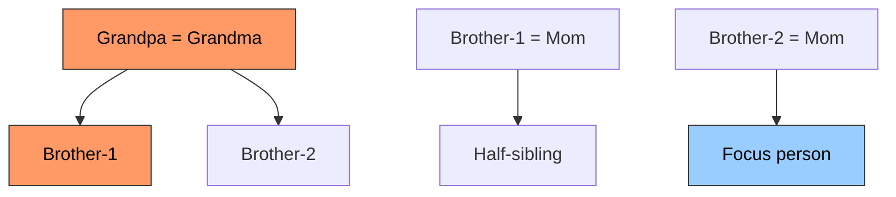

The cycles: Mom appears in two partnerships. Brother-1 is both Brother-2's sibling (reachable through the grandparents) and Mom's ex-partner (reachable through the couple card). Grandpa and Grandma are reachable as Brother-2's parents and independently as Brother-1's parents.

**The rendered DAG (cycle broken):**

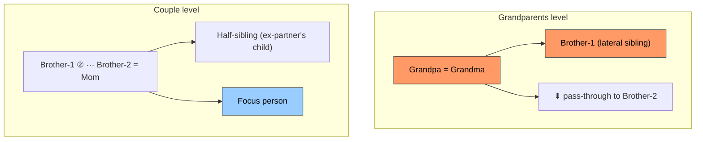

**What gets duplicated:** Brother-1 appears twice — once as a lateral relative in the grandparents' children row (Brother-2's sibling), and once as Mom's ex-partner in the couple card. These are two different roles: "Dad's sibling" and "Mom's former husband."

**Note on Mom:** Mom is not duplicated. She appears once in the couple card. Her own ancestry (upward from her) is a single branch on the right side. The cycle only exists on the paternal side.

---

### Type 3: Two Brothers Marry Two Sisters (Double First Cousins)

Brother-X and Brother-Y (sons of Grandparents-A) marry Sister-X and Sister-Y (daughters of Grandparents-B). Their children are "double first cousins" — they share ALL four grandparents, not just two. When those double cousins have a child together, that child reaches Grandparents-A twice AND Grandparents-B twice.

**The family graph (cyclic):**

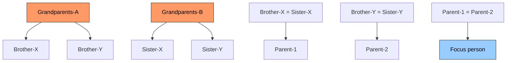

Focus person's ancestor walk: through Parent-1 → Brother-X → **Grandparents-A**, and through Parent-1 → Sister-X → **Grandparents-B**. But also: through Parent-2 → Brother-Y → **Grandparents-A** (again!), and through Parent-2 → Sister-Y → **Grandparents-B** (again!). Both sets of grandparents are reached twice.

**The rendered DAG (cycle broken):**

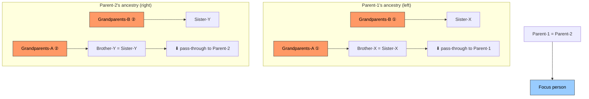

**What gets duplicated:** FOUR people (two couples) are each duplicated. Grandparents-A appear on both the left and right side. Grandparents-B also appear on both sides. This is the maximum duplication from a single-generation cousin marriage — every grandparent appears twice.

**Key difference from Type 1:** In Type 1 (simple cousin marriage), only one set of grandparents is shared. Here, both sets are shared, so the DAG is wider. The user sees the same four grandparents on both sides, which correctly communicates: "these two families are deeply intertwined."

---

### Type 4: Uncle Marries Niece (Generational Crossing)

A historically documented pattern: a man marries his brother's daughter. This creates a cycle that crosses generational levels — the same person appears as both a peer of the focus person's parent and as the focus person's grandparent's child.

**Why it's a cycle:** The focus person reaches Grandparents through the Uncle (one generation up), but also through the Niece → Niece's father (Uncle's brother) → Grandparents (two generations up through a different path). Grandparents are reached at different depths on each side.

**The family graph (cyclic):**

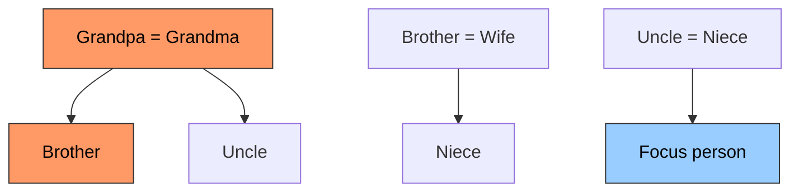

Focus → Uncle (father) → **Grandpa = Grandma**. Also: Focus → Niece (mother) → Brother = Wife → Brother → **Grandpa = Grandma**. The grandparents are reached at depth 2 on the left and depth 3 on the right.

**The rendered DAG (cycle broken):**

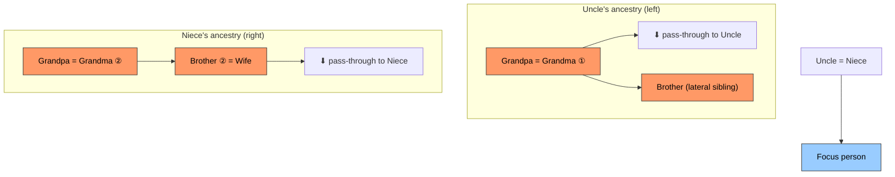

**What gets duplicated:** Grandpa = Grandma appear twice (once on each side). Brother also appears twice — as a lateral sibling on the left (Uncle's brother) and as Niece's parent on the right. These are different roles: "Dad's brother" vs. "Mom's father."

**Generational alignment note:** On the left, Grandpa = Grandma sit at generation 2. On the right, they sit at generation 3 (because the path through Niece is one step longer). Generational alignment ensures both copies still line up at the same vertical level — the right side's DAG is taller, and the left side has empty space above it.

---

### Type 5: Siblings Marry Into the Same Family (In-Law Loops via Partner Edges)

Two brothers (Brother-X and Brother-Y) marry two sisters (Sister-X and Sister-Y) — but unlike Type 3, the children of these unions do NOT marry each other. Instead, the focus person is a child of just one of the couples.

**Why it could create a cycle:** If we followed partner edges, we could go: focus person → Mom (Sister-X) → Sister-X's sister (Sister-Y) → Sister-Y's husband (Brother-Y) → Brother-Y's parents → Dad's parents — a loop back through a partner hop. But **Rule 1 prevents this** — partner edges are never followed to discover ancestors.

**The family graph (with partner-edge connections):**

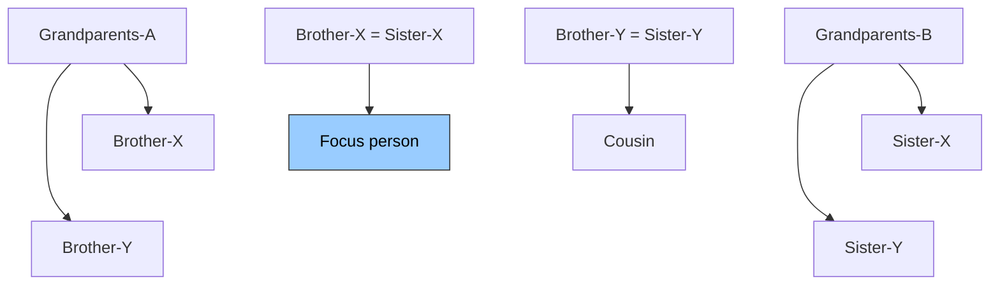

**The rendered DAG (no duplication needed):**

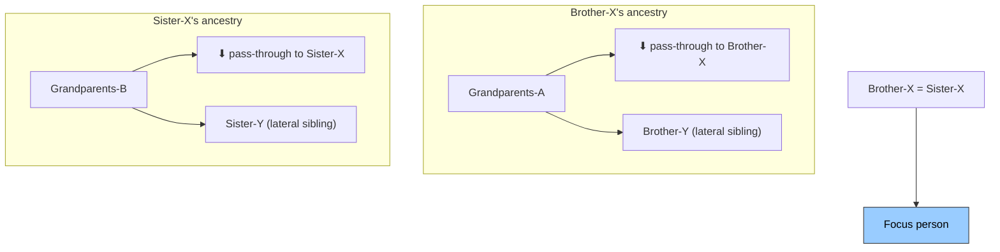

**What gets duplicated: Nothing.** Each set of grandparents only appears once. Brother-Y shows as Brother-X's sibling (lateral). Sister-Y shows as Sister-X's sibling (lateral). The fact that Brother-Y and Sister-Y are married to each other is invisible in this view — the partner edge between them is never followed.

The user can discover the Brother-Y / Sister-Y connection by clicking on Brother-Y (making him the focus person), at which point the view rebuilds centered on him and shows Sister-Y as his partner.

**This is the key insight of Type 5:** Not all intermarriage between families creates duplication. When the connection between two families runs only through partner edges (not parent edges), the two branches stay independent and no person needs to appear twice.

---

### Summary: What Gets Duplicated and When

| Cycle Type | Real-world scenario | What gets duplicated | How many extra cards |
|------------|-------------------|---------------------|---------------------|
| **Type 1** | Cousins marry | Shared grandparents | 2 (one couple) |
| **Type 2** | Woman remarries husband's brother | The deceased/ex-partner | 1 (appears as lateral + ex-partner) |
| **Type 3** | Two brothers marry two sisters, children marry | Both sets of grandparents | 4 (two couples) |
| **Type 4** | Uncle marries niece | Grandparents + the intermediate parent | 3 (one couple + one person) |
| **Type 5** | Siblings marry into same family (children don't intermarry) | Nothing | 0 (partner edges don't create cycles) |

The general rule: **duplication happens when and only when the same person is reachable by following parent edges upward through two different paths from the focus person.** Partner edges never create duplication — they connect people horizontally within a generation but are never followed during the upward or downward walk.

### Why Duplication Is the Right Choice

An alternative would be to "merge" duplicate ancestors — draw a single card with connector lines from both sides meeting at it. We chose duplication because:

1. **Simpler layout.** Merged nodes create complex connector routing that crosses over other branches, making the DAG harder to read.
2. **Consistent mental model.** Each side is a self-contained lineage. Users can trace from any ancestor straight down to the focus person without their eye jumping across the view.
3. **Professional precedent.** Most genealogy software (Ancestry, FamilySearch, MyHeritage) uses duplication, not merging. Users familiar with these tools expect this behavior.
4. **Clicking resolves ambiguity.** If a user notices "these two cards look the same," clicking either one navigates to the same person — confirming they are the same individual appearing in two roles.

The trade-off is that the view is wider than necessary when pedigree collapse occurs. For most families this is rare enough that it doesn't matter. For heavily collapsed families (e.g., European royal lineages), it gets noticeably wider, but the horizontal scroll handles it.

---

## Core Requirements

### Person-Centered Exploration

- There is always a **focus person**. The tree expands outward from them.
- Clicking any person in the tree re-centers the view on that person (the URL updates so it's shareable and survives page refresh).
- A searchable dropdown lets users jump to any family member without navigating the tree.

### Generational Alignment

**This is the single most important visual rule.**

All people of the same generation must appear at the same vertical level. A grandparent must never appear at the same height as a parent or great-grandparent, even when one side of the family has deeper ancestry than the other.

If the father's lineage goes back 5 generations and the mother's goes back 2, generation 2 on both sides must still line up horizontally.

### Ancestor Display (Upward)

- Parents appear above the focus person, grandparents above them, and so on.
- Each generation is a row of couples. At 3 ancestor generations, the top row can have up to 8 couples.
- When only one parent is known, the couple card shows a single person and the tree above has only one branch.

### Descendant Display (Downward)

- Children appear below the focus person, grandchildren below them, etc.
- Children are grouped by partner: children with the current partner, children with an ex-partner, and solo children (no known co-parent) each form a separate group.

### Couple Pairing

- Partners sit side-by-side in a shared container.
- Current partners are connected with a solid line.
- Ex-partners (divorced, separated) are connected with a dashed line.
- A person can have one current partner, multiple former partners, and multiple ex-partners — all visible in the couple card.

### Lateral Relatives

- Siblings, uncles/aunts, and cousins appear alongside the direct line when depth controls allow it.
- Lateral relatives can have their own descendants, creating nested subtrees.
- The depth of lateral expansion is controlled separately from ancestor/descendant depth.

### Depth Controls

Users can adjust three settings:

| Setting | Controls | Default |
|---------|----------|---------|
| **Ancestors** | How many generations upward to show | 2 |
| **Descendants** | How many generations downward to show | 1 |
| **Other** | How many ancestor levels expand lateral (non-direct-line) children. 0 = direct line only, 1 = siblings, 2 = cousins | 1 |

At the boundary of any depth limit, truncated branches show a "has more" indicator rather than cutting off silently.

---

## Visual Layout Rules

### Width Grows Exponentially

The tree width doubles with each ancestor generation. At 3 ancestors with laterals enabled, the top generation can easily exceed 3000px. The tree container scrolls horizontally, with the focus person scrolled into view on load.

### Couples Stay Compact

Partners in a couple sit close together (small gap). When the ancestor trees above would pull them apart, the couple stays centered and bent connectors bridge the gap to the ancestor branches above. This produces the natural "hourglass" shape seen in professional genealogy software.

### Connector Lines

| Connector | What it connects | Style |
|-----------|-----------------|-------|
| Branch | Couple card to their children below | Solid vertical + horizontal |
| Pass-through | An ancestor's children row to the coupled parent below | Solid vertical |
| Partner link | Ex/previous partner to main partner | Dashed (ex) or solid (previous) |
| Solo drop | Single parent to their solo children | Solid vertical |

### Cards

- Each person is a card showing their name, photo (or placeholder), and birth/death years.
- The focus person's card is visually highlighted (slight scale, accent border).
- Gender is indicated by a color-coded top border (blue, pink, or neutral).
- Cards have two click targets: name/photo re-centers the tree; a navigation icon goes to the person's detail page.

### Responsive Behavior

- **Desktop:** Full tree with horizontal scrolling. Side panel shows family members list and galleries.
- **Mobile:** Compact cards, the tree still scrolls horizontally but with smaller card widths.

---

## Edge Cases and Nuances

### Pedigree Collapse (Same Ancestor Through Both Parents)

When a person's parents share a common ancestor (e.g., first cousins who married), the shared ancestor appears twice in the tree — once on each parent's side. Both instances link to the same person; clicking either navigates to that person. This duplication is correct: the tree shows *positions*, not unique people.

### Asymmetric Depth

One parent's lineage may go back 5 generations while the other has only 1. The shallower side must not be stretched or padded to match. Generational alignment still applies — generation 2 on the left aligns with generation 2 on the right, even if the left side continues upward to generation 5.

### Single-Parent Ancestors

A person with only one known parent shows a single-person couple card. The ancestor tree above has one branch instead of two.

### Multiple Partner Groups

A person's couple card can show:
- One active partner (married or in a relationship)
- Previous partners (non-ex, sorted by marriage year)
- Ex-partners (divorced or separated)

Each group's children are tracked and displayed separately, with different connector line origins to make parentage unambiguous.

### Half-Siblings

Two people who share one parent but not the other. When the tree shows a parent's children, half-siblings appear alongside full siblings but descend from a different partner group.

### Solo Children

Children with no known co-parent descend directly from the single parent, separate from any partnered children groups.

### Placeholder Affordances

Where data is missing, the tree shows actionable placeholders: "Add Parent," "Add Spouse," "Add Child." These navigate to the appropriate creation workflow rather than being dead ends.

### Performance

The tree uses an in-memory graph built from 2 database queries. All subsequent navigation (re-centering, depth changes) uses the cached graph with zero additional queries. This keeps interaction snappy even for families with 500+ people.

---

## Glossary

| Term | Definition |
|------|-----------|
| **Focus person** | The person at the center of the tree. The tree expands from them. |
| **Couple card** | A UI element showing two partners side-by-side (or one person if no partner). |
| **Pass-through** | An empty placeholder in an ancestor's children row marking where the direct-line descendant connects to the couple card below. Not a visible card — just a routing point for connector lines. |
| **Direct line** | The lineage path straight up from the focus person through parents, grandparents, etc. |
| **Lateral relative** | A person not on the direct line who shares an ancestor with the focus person (siblings, uncles, cousins). |
| **Pedigree collapse** | When the same ancestor is reachable through multiple lineage paths (e.g., when cousins marry). |
| **Generation** | A level in the tree. Focus person = generation 0, parents = 1, grandparents = 2, etc. Children = -1, grandchildren = -2. |
| **Family unit** | A person + their partners + their children, structured as a group. |
| **Other depth** | Controls how many ancestor levels expand lateral children. 0 = direct line only, 1 = siblings, 2 = cousins. |
