# GraphView: Family DAG Visualization

This document describes **what** the GraphView must do and **why** — the requirements, constraints, and edge cases that make genealogy graphs fundamentally different from generic tree visualizations. For kinship terminology and labeling rules, see [docs/KINSHIP.md](../../../docs/KINSHIP.md). For the rendering implementation (CSS Grid, SVG connectors), see [docs/plans/2026-04-23-dag-grid-rendering-design.md](../../../docs/plans/2026-04-23-dag-grid-rendering-design.md).

---

## What Is the GraphView?

The GraphView is the visual family DAG (Directed Acyclic Graph) shown on the Family Show page. It lets a user pick any person in their family and see that person's ancestors above, descendants below, and partners alongside — all laid out in a CSS Grid so that each generation sits at the same horizontal level.

It is the primary way users explore "who is related to whom" in their family.

---

## Why Is This Hard?

A family is **not** a tree in the traditional sense. It's a graph with loops, forks, and multiple paths between the same people. The GraphView must flatten this messy graph into a DAG that *looks* like a tree while preserving genealogical correctness.

Specific reasons it's harder than a typical org chart or file browser:

1. **Two parents, not one.** Every person has (up to) two biological parents. This means the graph doubles in width with each ancestor generation: 1 couple, 2 couples, 4 couples, 8 couples.

2. **People play multiple roles.** The same person can be someone's uncle AND someone else's grandfather. In the graph, that person may appear in multiple positions — as a full cell for one role and a "(duplicated)" stub for another.

3. **Pedigree collapse.** When cousins marry, their children reach the same ancestor through both parents. Whether the second encounter creates a dup or reuses the existing cell depends on the [Duplication Rules](#duplication-rules).

4. **Partner relationships are horizontal.** Couples sit side-by-side within a generation, not in a parent-child hierarchy. Couples are **always on the same row** — when a generational crossing occurs, the cross-generation partner is duplicated at the needed row.

5. **Blended families.** Ex-partners, previous partners, and solo children create asymmetric branching. One person might have children with three different partners, each group needing its own visual treatment and connector routing lane.

### A Simple Family

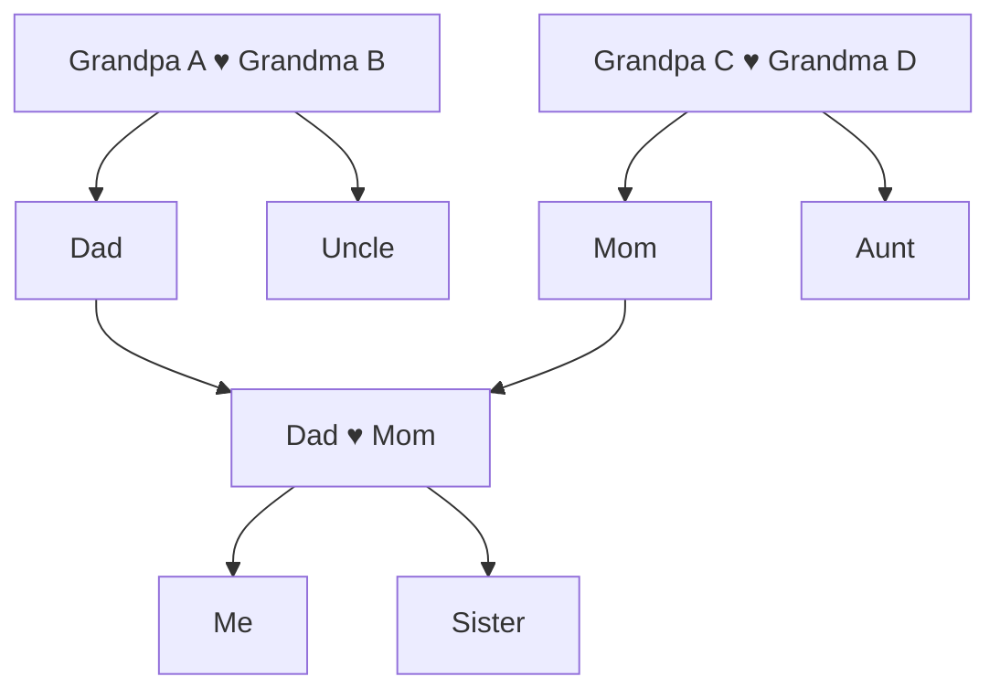

### Pedigree Collapse (Cousins Who Married)

The grandparents (A ♥ B) are reachable through both C and D. Since C and D are siblings at the same generation, they are reused — no duplication needed. Both appear as children of A ♥ B:

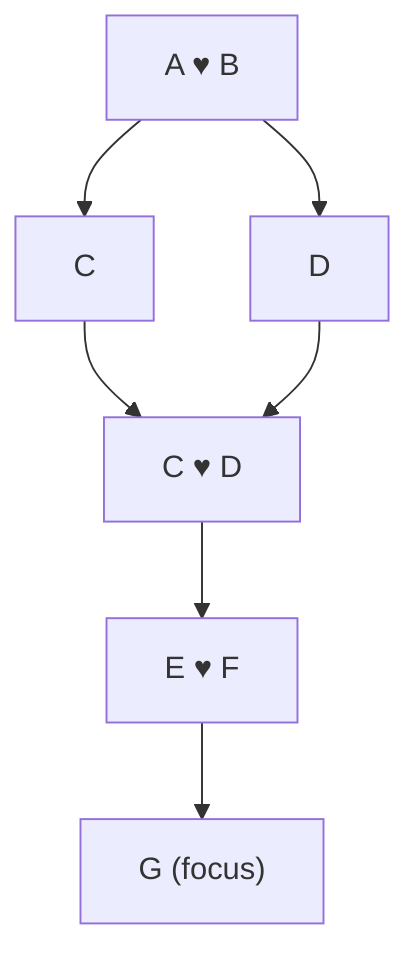

### Blended Family

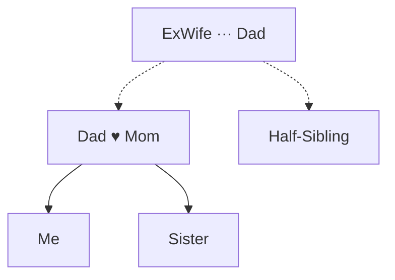

---

## How Cycles Are Broken: From Cyclic Graph to Directed Acyclic Graph

The family data is a cyclic graph — but the view must be a **directed acyclic graph (DAG)** with no cycles. It's not technically a tree either, since it has multiple root nodes (the oldest known ancestors) and multiple leaf nodes (the youngest descendants). This section explains the two rules that eliminate cycles and the duplication strategy that keeps the result genealogically correct.

### The Two Rules

**Rule 1: Only follow parent edges upward.** When building ancestors, the traversal walks upward through parent edges only. Partner edges are never followed to discover new ancestors — they're only used to display who is partnered with whom at each level.

**Rule 2: Only follow child edges downward.** When building descendants, the traversal walks downward through child edges only. It never follows a partner edge back up.

These two rules guarantee the output is acyclic.

### Duplication Rules

When a person is encountered a second time during traversal, the system applies three rules to decide whether to **reuse** the existing cell or create a **"(duplicated)" stub**:

**Rule 1: Same generation + compatible position → reuse.** One cell serves multiple roles (e.g., child of grandparents AND parent of grandchild). No dup needed. A position is "compatible" when the person's existing cell can serve the new role without requiring them to be adjacent to a new partner they're not already next to.

**Rule 2: Same generation + incompatible position → dup.** The person is already placed at the correct generation but in a different family group — they can't be moved adjacent to their partner without breaking sibling order or crossing connectors.

**Rule 3: Different generation → always dup.** A stub is placed at the needed generation row. This happens in generational crossings (e.g., uncle marries niece — the uncle is duplicated at the niece's generation to form a horizontal couple).

**Couples are always horizontal.** Partners must be adjacent on the same row. When partners are at different natural generations, the higher-generation partner is duplicated at the lower row. Dup stubs exist as visual partner markers at the needed row — they don't represent the person's natural generational level.

The dup stub is visually distinct (labeled "(duplicated)", reduced opacity) and clickable — navigating to the person's full context.

The DAG shows **positions** (roles in the family structure), not unique individuals.

---

### Catalog of Cycle Types

Every cycle in a family graph falls into one of five categories. Each is shown below as the problem (the real family graph, which has cycles) and the resolution (the rendered DAG).

---

### Type 1: Cousins Who Marry (Classic Pedigree Collapse)

The most common cycle in real genealogy. Two first cousins share the same grandparents and have a child together.

**Why it's a cycle:** The focus person's ancestor walk reaches the same couple (Grandpa + Grandma) through two independent paths — once up through Dad, once up through Mom.

**The family graph (cyclic):**

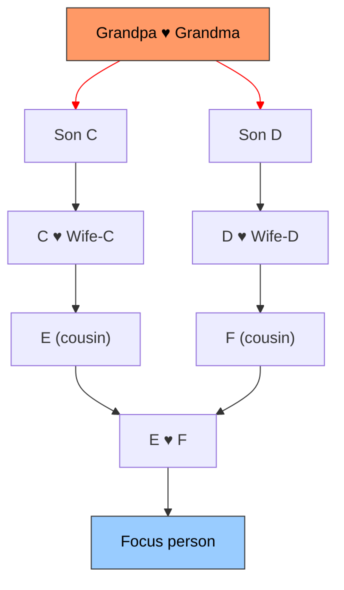

The red edges show the two paths that both reach Grandpa ♥ Grandma. That's the cycle: Focus → E → C → **Grandpa ♥ Grandma** and Focus → F → D → **Grandpa ♥ Grandma**.

**The rendered DAG (cycle broken):**

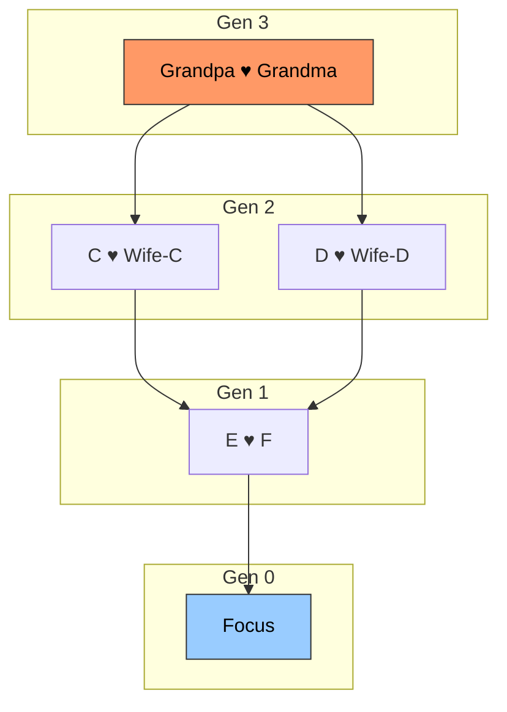

**What gets reused:** D is encountered a second time (as F's parent) at gen 2 — the same generation where he already appears as GP's child. **Rule 1 applies: same gen + compatible → reuse.** D's existing cell serves both roles (GP's child connected up, F's parent connected down via D+Wife-D). **No duplication needed.** GP+GM appear once with both C and D as children.

---

### Type 2: Woman Marries Two Brothers (Sequential Partnerships in the Same Family)

A common historical scenario. Mom marries Brother-1. Brother-1 dies. Mom then marries Brother-2. Children exist from both marriages.

**Why it's a cycle:** Brother-1 and Brother-2 share the same parents (the paternal grandparents). When we show the focus person's family, the paternal grandparents appear above Brother-2, but Brother-1 (the ex-partner) is also a child of those same grandparents. Additionally, Mom appears in two partnerships.

**The family graph (cyclic):**

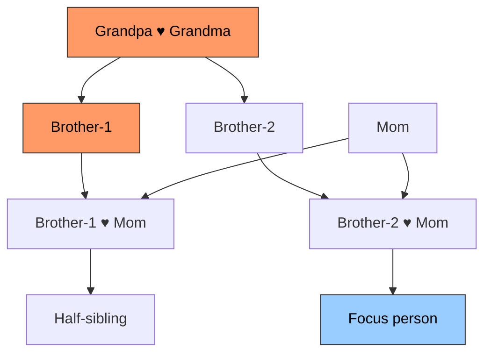

**The rendered DAG (cycle broken):**

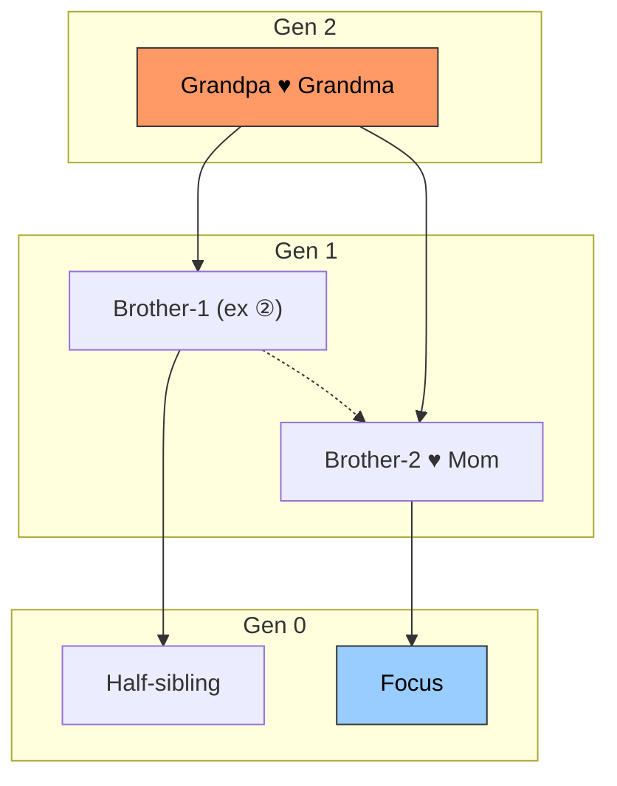

**What gets reused:** Brother-1 is encountered twice: first as GP's child (lateral sibling of Brother-2) at gen 1, then as Mom's ex-partner at gen 1. **Rule 1 applies: same gen + compatible → reuse.** Brother-1's single cell at gen 1 serves both roles — he's placed before the couple as the ex-partner: [Bro-1(ex), Bro-2, Mom]. His children (Half-sibling) connect from his cell, while Focus connects from the Bro-2+Mom couple center. **No duplication needed.**

**Note on Mom:** Mom is not duplicated. She appears once in the couple row. Her own ancestry (upward from her) is a single branch on the right side. The cycle only exists on the paternal side.

---

### Type 3: Two Brothers Marry Two Sisters (Double First Cousins)

Brother-X and Brother-Y (sons of Grandparents-A) marry Sister-X and Sister-Y (daughters of Grandparents-B). Their children are "double first cousins" — they share ALL four grandparents, not just two. When those double cousins have a child together, that child reaches Grandparents-A twice AND Grandparents-B twice.

**The family graph (cyclic):**

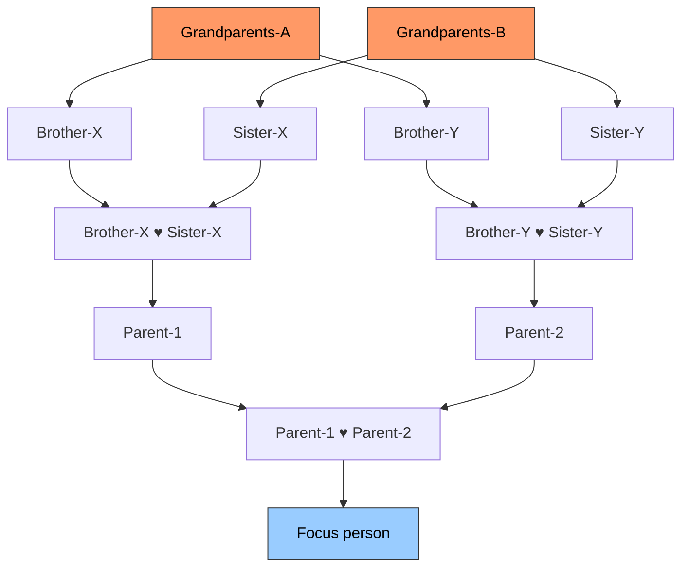

**The rendered DAG (cycle broken, with laterals — default):**

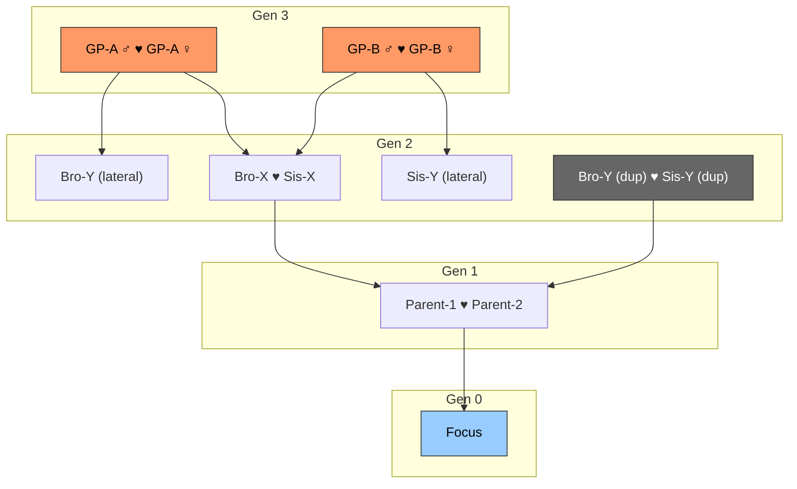

**What gets duplicated:** Brother-Y and Sister-Y each appear twice (2 extra cards): once as laterals on the left (children of Grandparents-A and Grandparents-B) and once as "(duplicated)" stubs on the right. **Rule 2 applies: same gen + incompatible position → dup.** Bro-Y is in GPA's family group (col 0) and Sis-Y is in GPB's family group (col 3) — they can't be made adjacent without breaking sibling order. So dup stubs are placed together (cols 4-5) to form Parent-2's parents. **Grandparents-A and Grandparents-B each appear only once.**

**When laterals are off** (Other depth = 0): Brother-Y and Sister-Y aren't visible on the left, so the traversal continues past them to the grandparents. The second occurrence of each grandparent set is placed as a "(duplicated)" stub.

**Key difference from Type 1:** In Type 1, only one set of grandparents is reached twice at the same generation (reuse applies). Here, two families interleave, so the lateral positions are incompatible and stubs are needed.

---

### Type 4: Uncle Marries Niece (Generational Crossing)

A historically documented pattern: a man marries his brother's daughter. This creates a cycle that crosses generational levels — the uncle is naturally one generation above the niece, but they are partners.

**Why it's a cycle:** The focus person reaches Grandparents through the Uncle (one generation up), but also through the Niece → Niece's father (Uncle's brother) → Grandparents (two generations up through a different path). Grandparents are reached at different depths on each side.

**The family graph (cyclic):**

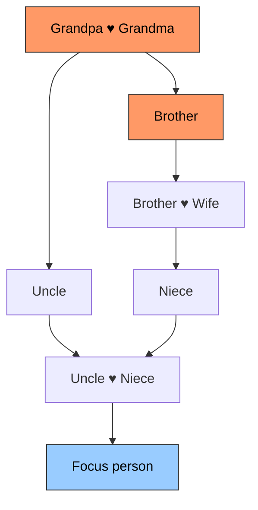

**The rendered DAG (cycle broken):**

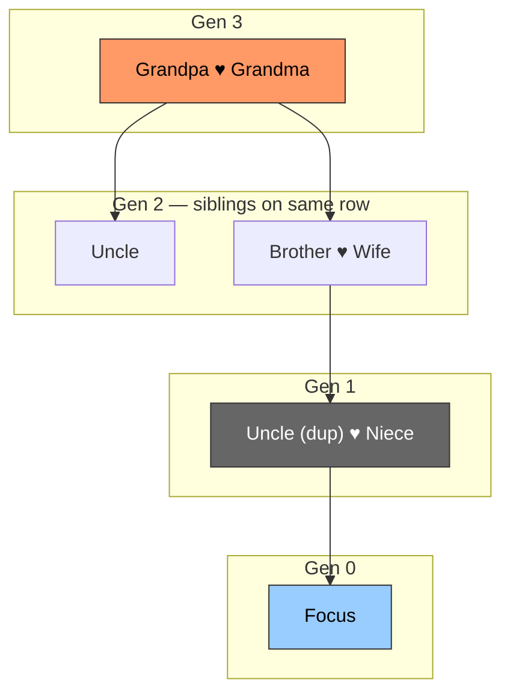

**Generational alignment:** Uncle and Brother are siblings and must be at the same row (gen 2). Niece is Brother's daughter, one generation below (gen 1). The couple Uncle+Niece spans two natural generations.

**What gets duplicated:** Uncle is duplicated at gen 1 (next to Niece). **Rule 3 applies: different gen → always dup.** Uncle's natural generation is 2 (with his sibling Brother), but he needs to appear at gen 1 to form a horizontal couple with Niece. The dup stub at gen 1 is a visual partner marker, not representing Uncle's natural generation.

**What gets reused:** Brother at gen 2 serves dual roles: GP's child (connected up) and Niece's parent with Wife (connected down). **Rule 1 applies: same gen + compatible → reuse.** No dup needed for Brother.

**All couples are horizontal.** Uncle(dup)+Niece at gen 1 is a standard horizontal couple. All parent→child connectors span exactly 1 row. No vertical couple connectors.

---

### Type 5: Siblings Marry Into the Same Family (In-Law Loops via Partner Edges)

Two brothers (Brother-X and Brother-Y) marry two sisters (Sister-X and Sister-Y) — but unlike Type 3, the children of these unions do NOT marry each other. Instead, the focus person is a child of just one of the couples.

**Why it could create a cycle:** If we followed partner edges, we could go: focus person → Mom (Sister-X) → Sister-X's sister (Sister-Y) → Sister-Y's husband (Brother-Y) → Brother-Y's parents → Dad's parents — a loop back through a partner hop. But **Rule 1 prevents this** — partner edges are never followed to discover ancestors.

**The family graph (with partner-edge connections):**

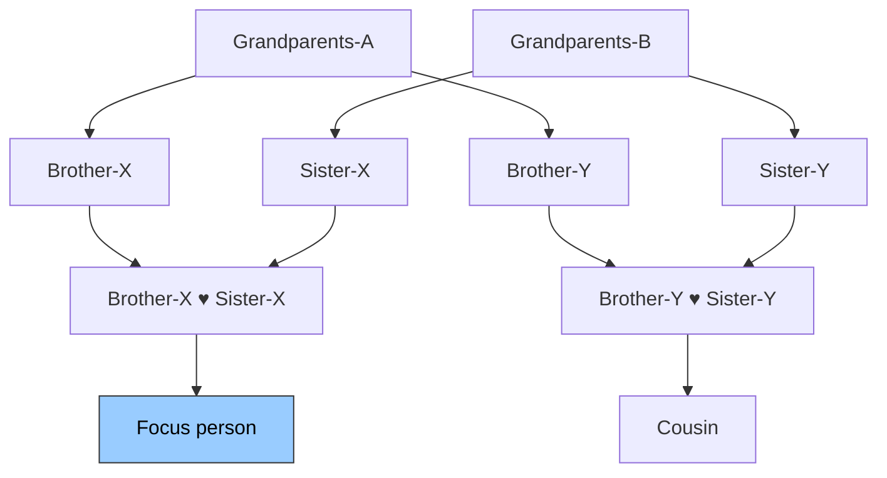

**The rendered DAG (no duplication needed):**

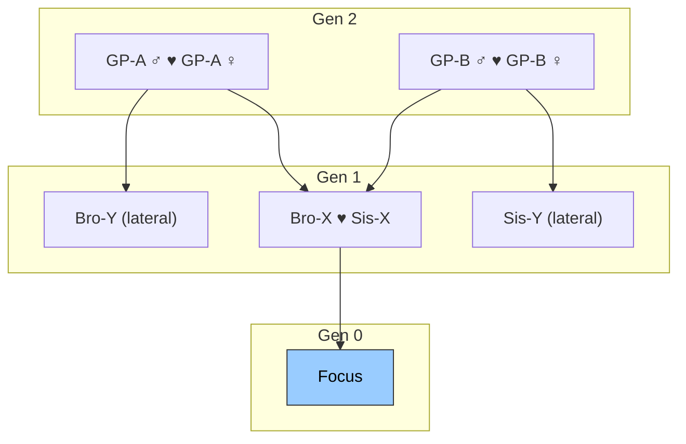

**What gets duplicated: Nothing.** Each set of grandparents only appears once. Brother-Y shows as Brother-X's sibling (lateral). Sister-Y shows as Sister-X's sibling (lateral). The fact that Brother-Y and Sister-Y are married to each other is invisible in this view — the partner edge between them is never followed.

The user can discover the Brother-Y / Sister-Y connection by clicking on Brother-Y (making him the focus person), at which point the view rebuilds centered on him and shows Sister-Y as his partner.

**This is the key insight of Type 5:** Not all intermarriage between families creates duplication. When the connection between two families runs only through partner edges (not parent edges), the two branches stay independent and no person needs to appear twice.

**With `other=2`:** When showing cousins, the traversal expands Bro-Y's descendants. His partner Sis-Y is already visible (as GPB's child) but in a different family group (incompatible position). **Rule 2 applies:** Sis-Y(dup) is placed next to Bro-Y to form the couple, and their child (Cousin) appears at gen 0.

---

### Summary: What Gets Duplicated and When

| Cycle Type | Real-world scenario | Resolution | Extra cards |
|------------|-------------------|------------|-------------|
| **Type 1** | Cousins marry | Reused: D at same gen as GP's child and F's parent | 0 |
| **Type 2** | Woman remarries husband's brother | Reused: Bro-1 at same gen as sibling and ex-partner | 0 |
| **Type 3** | Two brothers marry two sisters, children marry | Dup: Bro-Y + Sis-Y (same gen, incompatible positions) | 2 |
| **Type 4** | Uncle marries niece | Dup: Uncle at gen 1 (different gen from natural gen 2). Reused: Brother (same gen, dual role) | 1 |
| **Type 5** | Siblings marry into same family (children don't intermarry) | Nothing | 0 |

The general rules:
1. **Same gen + compatible position → reuse** — one cell serves multiple roles
2. **Same gen + incompatible position → dup** — can't be moved adjacent without breaking layout
3. **Different gen → always dup** — partner stub placed at the needed row

Couples are always horizontal. Partner edges never create duplication on their own — they connect people within a generation but are never followed during the upward or downward walk.

---

## Core Requirements

### Person-Centered Exploration

- There is always a **focus person**. The graph expands outward from them.
- Clicking any person in the graph re-centers the view on that person (the URL updates so it's shareable and survives page refresh).
- A searchable dropdown lets users jump to any family member without navigating the graph.

### Generational Alignment

**This is the single most important visual rule.**

All people of the same generation must appear at the same vertical level. A grandparent must never appear at the same height as a parent or great-grandparent, even when one side of the family has deeper ancestry than the other.

If the father's lineage goes back 5 generations and the mother's goes back 2, generation 2 on both sides must still line up horizontally.

### Ancestor Display (Upward)

- Parents appear above the focus person, grandparents above them, and so on.
- Each generation is a row in the CSS Grid.
- When only one parent is known, the cell shows a single person and the row above has only one branch.

### Descendant Display (Downward)

- Children appear below the focus person, grandchildren below them, etc.
- Children are grouped by partner: children with the current partner, children with an ex-partner, and solo children (no known co-parent) each form a separate group.

### Couple Pairing

- Partners sit side-by-side in two contiguous grid cells, visually glued with CSS.
- Current partners are connected with a solid line.
- Ex-partners (divorced, separated) are connected with a dashed line.
- A person can have one current partner, multiple former partners, and multiple ex-partners — all visible at the same generation row.

### Lateral Relatives

- Siblings, uncles/aunts, and cousins appear alongside the direct line when depth controls allow it.
- Lateral relatives can have their own descendants, creating nested subtrees.
- The depth of lateral expansion is controlled separately from ancestor/descendant depth.

### Depth Controls

Users can adjust three settings:

| Setting | Controls | Default |
|---------|----------|---------|
| **Ancestors** | How many generations upward to show | 2 |
| **Descendants** | How many generations downward to show | 2 |
| **Other** | How many ancestor levels up to walk, then expand all descendants from those ancestors. Descendants bounded by the `descendants` setting relative to focus. 0 = direct line only, 1 = siblings, 2 = cousins | 1 |

At the boundary of any depth limit, truncated branches show a "has more" indicator (icon within the person card) rather than cutting off silently.

---

## Visual Layout Rules

### CSS Grid Layout

The graph is rendered as a CSS Grid where each person occupies exactly one cell at a computed `(col, row)` position. Elixir computes all grid coordinates; HEEx places cells; JS draws SVG connectors.

### Width Grows Exponentially

The grid width doubles with each ancestor generation. At 3 ancestors with laterals enabled, the top generation can easily exceed 3000px. The grid container scrolls horizontally, with the focus person scrolled into view on load.

### Separators

Empty grid cells (separator nodes) serve three purposes:
1. **Centering padding** — ensure couples can center perfectly above their children
2. **Group boundaries** — visual whitespace between children of different parents
3. **Width equalization** — narrower generations padded to match the widest

### Couples Stay Compact

Partners in a couple sit in two contiguous grid cells, visually glued with CSS to appear as one unit. When the ancestor rows above are wider, the couple stays compact and bent connectors bridge the gap to the ancestor branches above.

### Connector Lines

Connectors are drawn as SVG paths by a JS hook over the CSS Grid. Three types:

| Connector | What it connects | Style |
|-----------|-----------------|-------|
| Branch | Couple center to their children below | Solid vertical + horizontal bar + vertical drops |
| Parent→Child | Single parent to their child below | Solid orthogonal path |
| Couple link | Partners within a row | Solid (current) or dashed (ex/previous) horizontal |

Each connector element carries a `data-relationship-kind` attribute (e.g., `"married"`, `"divorced"`) for CSS styling. New relationship types are automatically supported.

**Layered routing:** When multiple child groups share the same row gap (couple children + solo children + ex-partner children), each group routes at a different vertical lane to prevent visual merging.

### Cards

- Each person is a card in a grid cell showing their name, photo (or placeholder), and birth/death years.
- The focus person's card is visually highlighted (accent border).
- Gender is indicated by a color-coded top border (blue, pink, or neutral).
- Cards have two click targets: name/photo re-centers the graph; a navigation icon goes to the person's detail page.

### Responsive Behavior

- **Desktop:** Full graph with horizontal scrolling. Side panel shows family members list and galleries.
- **Mobile:** Compact cards, the graph still scrolls horizontally but with smaller card widths.

---

## Edge Cases and Nuances

### Pedigree Collapse (Same Ancestor Through Both Parents)

When a person's parents share a common ancestor (e.g., first cousins who married), the [Duplication Rules](#duplication-rules) determine whether the second encounter reuses the existing cell or creates a stub. See the [Catalog of Cycle Types](#catalog-of-cycle-types) for the full breakdown.

### Asymmetric Depth

One parent's lineage may go back 5 generations while the other has only 1. The shallower side has separator cells at higher rows. Generational alignment still applies — generation 2 on the left aligns with generation 2 on the right, even if the left side continues upward to generation 5.

### Single-Parent Ancestors

A person with only one known parent shows a single-person cell. The ancestor row above has one branch instead of two.

### Multiple Partner Groups

A person's row can show:
- One active partner (married or in a relationship)
- Previous partners (non-ex, sorted by marriage year)
- Ex-partners (divorced or separated)

Each group's children are tracked and displayed separately, with different connector routing lanes to make parentage unambiguous.

### Half-Siblings

Two people who share one parent but not the other. When the graph shows a parent's children, half-siblings appear alongside full siblings but descend from a different partner group.

### Solo Children

Children with no known co-parent descend directly from the single parent, separate from any partnered children groups.

### Placeholder Affordances

Where data is missing, the graph shows actionable placeholders: "Add Parent," "Add Spouse," "Add Child." These navigate to the appropriate creation workflow rather than being dead ends.

### Performance

The graph uses an in-memory graph built from 2 database queries. All subsequent navigation (re-centering, depth changes) uses the cached graph with zero additional queries. This keeps interaction snappy even for families with 500+ people.

---

## Glossary

| Term | Definition |
|------|-----------|
| **Focus person** | The person at the center of the graph. The graph expands from them. |
| **GraphNode** | A cell in the CSS Grid — either a `:person` (with photo, name, etc.) or a `:separator` (empty cell for spacing). |
| **GraphEdge** | A connection between two nodes — parent→child, current partner, or previous partner. Carries a `relationship_kind` for styling. |
| **Separator** | An empty grid cell that provides centering padding, group boundaries, or width equalization. |
| **Direct line** | The lineage path straight up from the focus person through parents, grandparents, etc. |
| **Lateral relative** | A person not on the direct line who shares an ancestor with the focus person (siblings, uncles, cousins). |
| **Pedigree collapse** | When the same ancestor is reachable through multiple lineage paths (e.g., when cousins marry). |
| **Generation** | A row in the grid. Focus person = generation 0, parents = 1, grandparents = 2, etc. Children = -1, grandchildren = -2. |
| **Family unit** | A set of siblings (children of the same couple) plus their partners, structured as a group within a generation row. |
| **Other depth** | Controls how many ancestor levels up to walk before expanding all descendants. 0 = direct line only, 1 = siblings, 2 = cousins. |
| **Duplicated stub** | A "(duplicated)" card marking that a person already appears elsewhere in the graph. Clickable — navigates to the person's full context. |
| **Generational crossing** | When partners are at different natural generations (e.g., uncle marries niece). Resolved by duplicating the higher-gen partner at the lower row. |
